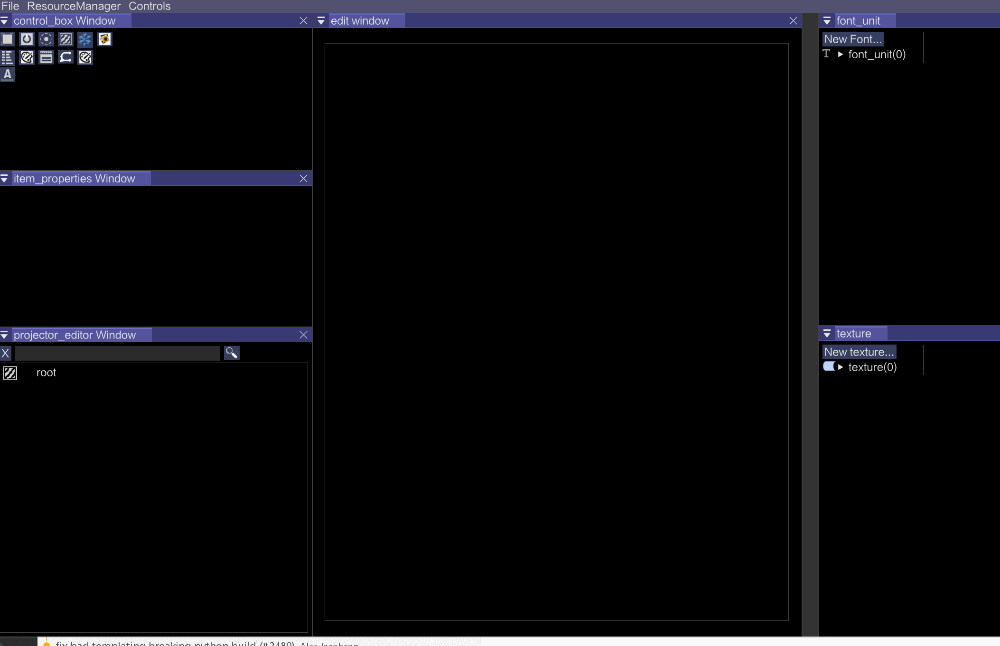
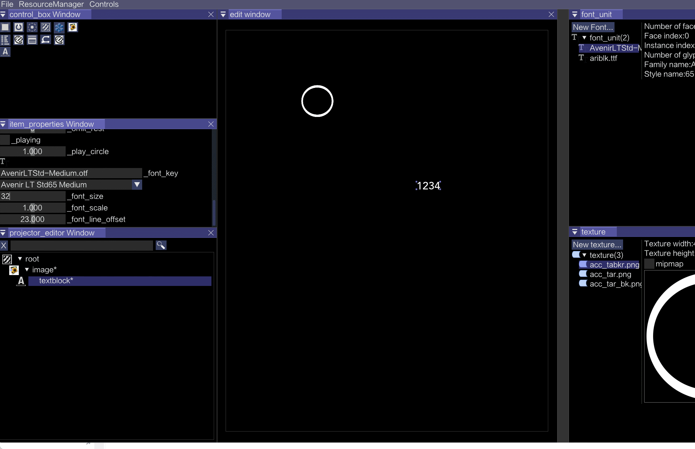
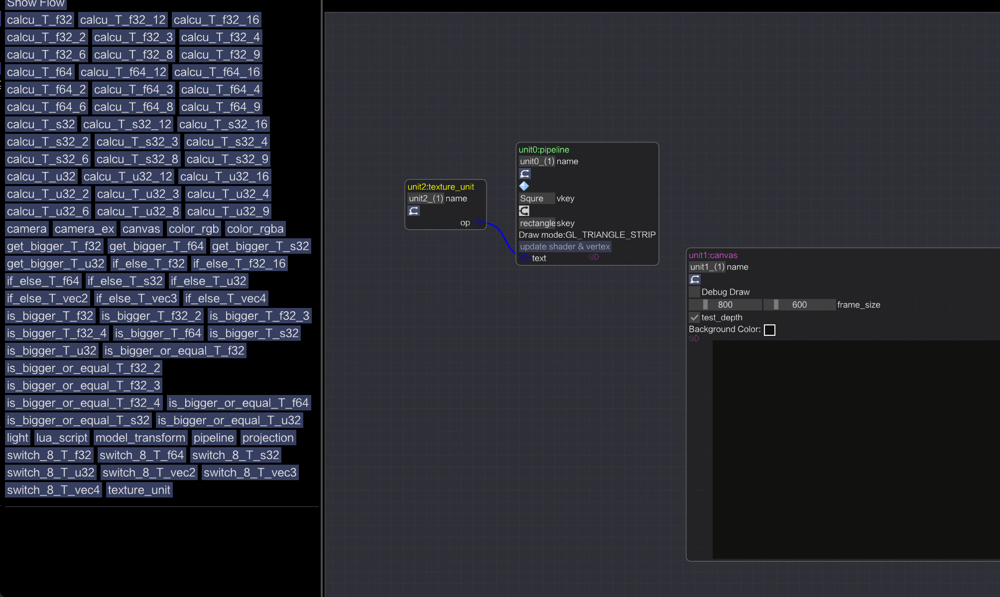
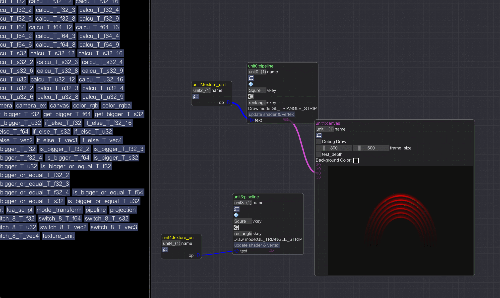

# HSG

HSG is a simple, lightweight, and easy to use graphics engine for creating HMI applications.
It is written in C++ and uses the OpenGL API for rendering.

Simply drag and drop your assets into the HSG IDE and automatically generate the referencable resouces for your application.
 
 
The coolest feature in HSG is the pipeline function. The pipeline is somewhat like a blueprint (in UE), where you simply drag some computing units and link them together to define an independent rendering pipeline.This is very useful for verifying and debugging certain shader code.

